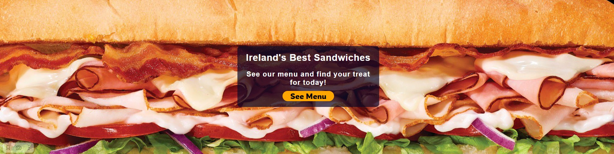
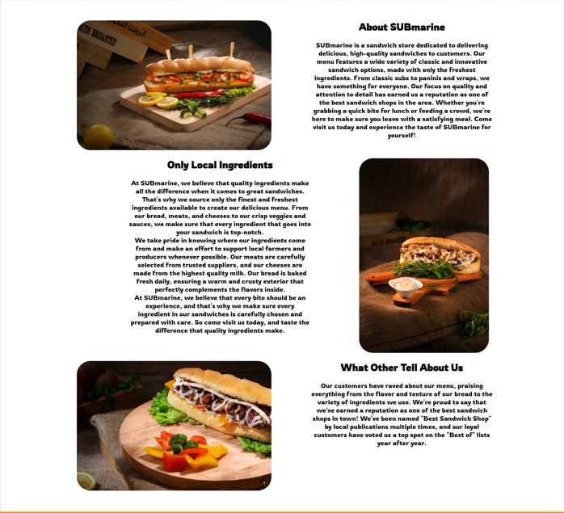
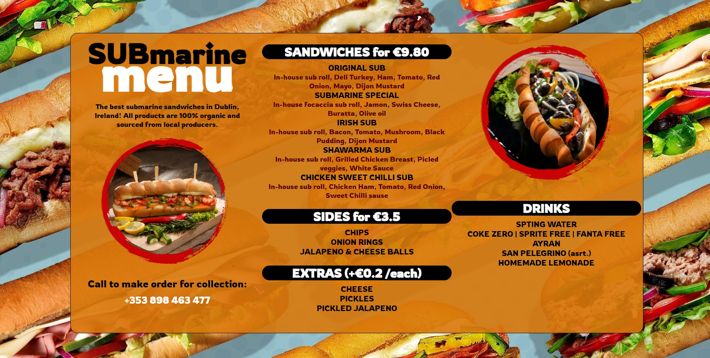
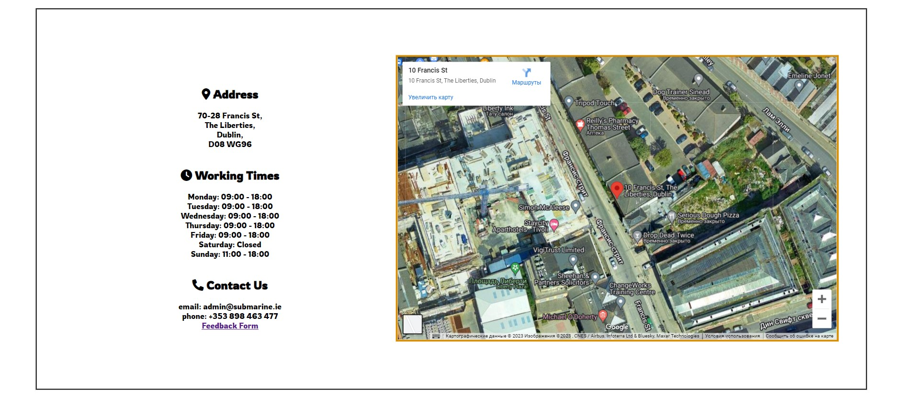
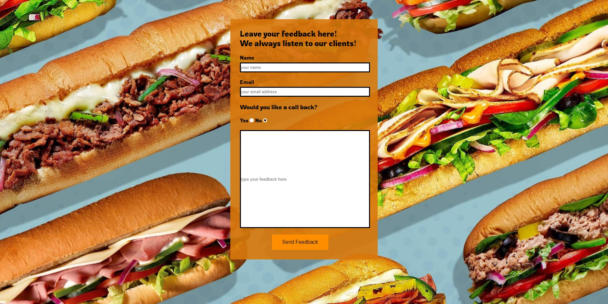

# SUBmarine - sandwiche shop

[Deployed Website](https://assetmendy.github.io/ci-p1-submarine/)

# Table Of Contents

- [Introduction](#introduction)
- [User Goals and Stories](#user-goals-and-stories)
  - [Website Owner Business Goals](#website-owner-business-goals)
  - [Customer goals](#customer-goals)
  - [User Stories](#user-stories)
    - [From business owner prospective](#from-business-owner-prospective)
    - [From a user prospective](#from-a-user-prospective)
- [Design of the website](#design-of-the-website)
  - [General](#general)
  - [Wireframes](#wireframes)
  - [Color palette](#color-palette)
- [Features](#features)
  - [Navigation menu](#navigation-menu)
  - [Landing page image](#landing-page-image)
  - [Business introduction](#business-introduction)
  - [Footer](#footer)
  - [Menu page](#menu-page)
  - [Contacts page](#contacts-page)
  - [Feedback form](#feedback-form)
  - [Not implemented features](#not-implemented-features)
- [Testing](#testing)
  - [Manual testing](#manual-testing)
  - [Responsiveness](#screen-responsiveness-test)
  - [HTML/CSS Validation](#validator-test)
- [Deployment](#deployment)
- [Credits](#credits)

  

# Introduction

This is a website for SUBmarine, a fictional sandwiches shop in Dublin, Ireland. The website's purpose is to present shop's products to potential customers online and increasing shop's sales by acquairing a client-base via internet.

The website targets people who want to buy a quick meal in convenient way, saving time to by getting to know shops menu in advance. The website showcases the menu avaialable and some exmaples of the products, and provides all required info in advace before making an order at the store or by a call.

# User Goals and Stories

## Website Owner Business Goals
Owner of the business goal

* Show potential customer menu of the shop
* Provide customers with all requried information, such as, location, phone number and working schedule 
* Acquire new clients and encorage them to buy in the store
* Provide background information about the business and what kind of ingredients is used

## Customer goals
Customer goals

  * Easily navigate in the website
  * Get the information required in most effecient way
  * Find out what kind of products store has
  * Find out prices for the products
  * Find out business work hours and location
  * Be able to view the website on any screen size

## User Stories

### From business owner prospective

  * Gather new client base
  * Provide its services/products to a wider range of people
  * Increase sales of the product
  * Learn people about the business

### From a user prospective

  * Be able to order a take away
  * Learn the location of the business
  * Learn working hours
  * Learn a contact details

# Design of the website

## General

The website consists of three pages: Home, Menu and Contacts pages, and one additional Feedback page that can be accessed only from Contacts page Each page is designed to provide a user with all possible information that a potential customer needs to make a purchase. The navigational menu is designed at the center of the website to reduces the time for navigating, instead of hovering to a corner of the page each time.

Home page:
Home page provides a user with general information about the business and let's users know what kind of products and ingredients are used. (Screenshots: [Desktop](/documentation/home-page-desktop.png)/[Mobile](/documentation/home-page-mobile.png))

Menu page: 
Menu page provides essential information about what kind of products business offers and also notifies users, that order can be made for collection via phone call. (Screenshots: [Desktop](/documentation/menu-page-desktop.png)/[Mobile](/documentation/menu-page-mobile.png))

Contacts page:
Contacts page provides with workings hours, address, contacts details and a map to give better understanding of business location. (Screenshots: [Desktop](/documentation/contacts-page-desktop.png)/[Mobile](/documentation/contacts-page-mobile.png))

Feedback page:
Feedback page allows a user to leave any feedback to a business owner. Following info is required from a user prior sending a feedback: Name, Email address, Option to call back and feedback text. (Screenshots: [Desktop](/documentation/feedback-page-desktop.png)/[Mobile](/documentation/feedback-page-mobile.png)) 

The footer of the website is duplicates some contacts info, so a user could learn the essential contacts information quicker. 

## Wireframes

Wireframes for this project can be found here: [Wireframe Screenshots](/documentation/wireframe-screenshots)

## Color palette

Inspiration for a design of the website was made according to association to a sandwiches. Overall website uses a default color palette of white and black, and to accompany prodcuts color orange with slightly red tone was used to stimulate potential clients.

# Features

  ### Navigation menu

  - Consists of logo and navigation links to all three pages, as well, logo functions as a link Home page.
  - For better navigation current page is undelined, menu style is the same and links are responsive when user hovers on them.
  - To keep users attention in one spot without the need to jump across the corners of the website, the logo and links are centered at the middle of the screen.

  

  ### Landing page image

  - Langing image is designed with picturing main topic of the business, which is sandiwhces. 
  - Landing page has a text, that calls a user to an action to view the menu and the button that redirects to Menu page is provided for quicker navigation.

  

  ### Business introduction

  - Introduction section gives a user understanding about the business and the way the business operates
  - To promote trust about the quality of the products, brief information about ingredients quality and source are provided
  - As additional reason to trust the business, section includes the awards and reviews

  

  ### Footer

  - Footer consists of business address, working hours and links to social networks
  - Footer give opportunity to a user to learn important information, such as, locationa and working hours of the business without the need to move to a specific page
  - Social links provide a user a chance to follow the business on social network, and keep themself up to date. As well, following on socials allows business owner to have understanding about the client base

  

  ### Menu page

  - Menu page focuses on the menu of the business
  - Menu allows a user to learn what products are available and make up their mind before the purchase, without the need to be present at the store
  - First section of the menu has a call to action text to promote users to make an order via a call

  

  ### Contacts page

  - Contacts page consists of Address, Working hours and Contact details (email and phone), as well as a map with pinned location of the business
  - A map snippet allows a user to have better understanding of the location
  - Phone and email information is designed as a quick action buttons. This allows a user just to tap on a email address or phone number, which will open them in corresponding application

  

  ### Feedback form
  
  - Feedback form provides a user a chance to leabe a feedback to a business owner about the store services and products
  - Feedback form is avaialble in Contacts page as a link that redirect to a Feedback page

  

  #### Not implemented features

  - Initially Order page was considered, but due to this feature requires some JavaScript to be used, it was postponed for future

  # Testing

  ### Manual Testing

  - Manual testing was performed in order to indetify any bugs or potential issues. Issue with image optimization was identified, when network connection was manually limited.
  
  ### Screen responsiveness test

  - The website passed a test for screen responsiveness
  - The website responsiveness were tested with two ways:
    - Using DevTools and simulating different screens, in particular the screen resolution of iPad Air, iPhone 12 and Samsung Galaxy S8
    - Using real hardware: Samsung Note 8, iPhone 11 Pro and 

  ### Validator test

  __HTML validation through W3C validator: No errors were returned when validating:__
  - [Index.html](https://validator.w3.org/nu/?showsource=yes&showoutline=yes&showimagereport=yes&doc=https%3A%2F%2Fassetmendy.github.io%2Fci-p1-submarine%2Findex.html#textarea)
  - [Menu.html](https://validator.w3.org/nu/?doc=https%3A%2F%2Fassetmendy.github.io%2Fci-p1-submarine%2Fmenu.html)
  - [Contact.html](https://validator.w3.org/nu/?showsource=yes&doc=https%3A%2F%2Fassetmendy.github.io%2Fci-p1-submarine%2Fcontacts.html)
  - [Feedback.html](https://validator.w3.org/nu/?doc=https%3A%2F%2Fassetmendy.github.io%2Fci-p1-submarine%2Ffeedback.html)
  
  __CSS validation through Jigsaw: No errors were returned when validating__:

  - [Results for CSS](https://jigsaw.w3.org/css-validator/validator?uri=https%3A%2F%2Fassetmendy.github.io%2Fci-p1-submarine%2Findex.html&profile=css3svg&usermedium=all&warning=1&vextwarning=&lang=ru)

  # Deployment

  For website deployment GitHub Pages was used as a hosting platform. The deployed website can be found in following link - https://assetmendy.github.io/ci-p1-submarine/

  __To deploye the website, follow:__
  - In the GitHub repository, navigate to the Settings tab 
  - From the source section drop-down menu, select the Master Branch
  - Once the master branch has been selected, the page will be automatically refreshed with a detailed ribbon display to indicate the successful deployment. 
  
  # Credits

  ### Media

  - All stock images, inluding Hero image, Menu images, and Sandwich section images were downloaded from [Pexels](https://www.pexels.com/), contributor of media to Pexels is [Rajesh TP](https://www.pexels.com/@rajesh-tp-749235/)
  - Menu page inspiration is from [Envastudio](https://www.freepik.com/author/envastudio) from following [Menu Template](https://www.freepik.com/premium-vector/sandwich-menu-template-fast-food-restaurant_12908342.htm)
  - Favicon was used from [Flaticon](https://www.flaticon.com/free-icon/sandwich_184514)
  - Fonts were imported from [Google Fonts](https://fonts.google.com/)
  - Icons were used from [Font Awesome](https://fontawesome.com/)

  ### Content

  - Current ReadME file is based on [ReadME template](https://github.com/Code-Institute-Solutions/readme-template) prepared by Code Institute
  - Map snippet and corresponding code was used from [Google Maps](https://www.google.com/maps)
  - Text in Busines Information section was created using [ChatGPT](https://chat.openai.com/chat)

  ### Code

  __During writing a code in HTML and CSS, following resources were used on tutorial bases:__
  - [A Complete Guide to Flexbox](https://css-tricks.com/snippets/css/a-guide-to-flexbox/)
  - [Flexbox CSS In 20 Minutes](https://www.youtube.com/watch?v=JJSoEo8JSnc)
  - [Learn CSS position in 5 minutes](https://www.youtube.com/watch?v=Pp7UXS3P6jY)
  - [Learn CSS Display Property In 4 Minutes](https://www.youtube.com/watch?v=Qf-wVa9y9V4)
  - [W3School](https://www.w3schools.com/)